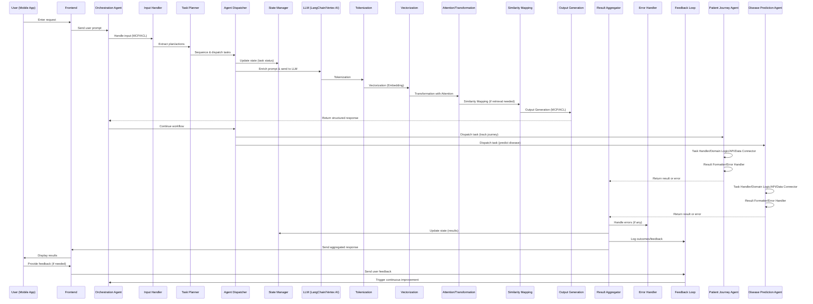

# Multi-Agent Healthcare System

## Project Overview
This project aims to develop a multi-agent system for the healthcare domain. The goal is to demonstrate how multiple intelligent agents can collaborate to solve healthcare-related problems using an orchestration agent with sub-agents architecture.

### Initial Agent Design
- **Orchestration Agent:** Coordinates the actions and communication between sub-agents.
- **Patient Journey Agent:** Tracks and manages the patient's journey through the healthcare system (appointments, treatments, follow-ups, etc.).
- **Disease Prediction Agent:** Predicts possible diseases based on patient symptoms using rule-based or machine learning approaches.

This modular design allows for easy extension by adding more agents in the future, each responsible for a specific healthcare task.

> **Note:** While peer-to-peer (decentralized) agentic systems are possible in multi-agent architectures, this project uses an orchestration agent, which is a centralized design. The orchestration agent manages and coordinates all sub-agents, providing a single point of control and communication. This approach simplifies coordination but differs from decentralized systems where agents interact directly with each other without a central controller.

## System Architecture Diagram

Below is a placeholder for the system architecture diagram. This diagram should illustrate the main components and their interactions:

- **Frontend (React Native + NX Micro Frontends)**
  - Communicates with backend APIs
- **Backend**
  - **Orchestration Agent (FastAPI/Python)**
    - Coordinates sub-agents
    - Integrates with LangChain and Google Vertex AI (via Firebase)
    - Connects to Neo4j for ontology/graph data
  - **Sub-Agents**
    - Patient Journey Agent
    - Disease Prediction Agent
  - **Other Backend Services (Spring Boot/Java)**
- **Databases**
  - Neo4j (Ontology/Graph)
  - **Firebase Firestore:** For real-time, cloud-hosted NoSQL database needs, such as storing user data, patient records, and supporting real-time updates in the mobile app. [Firestore Documentation](https://firebase.google.com/docs/firestore)
  - **Firebase Realtime Database:** For scenarios requiring low-latency, real-time data synchronization (e.g., live chat, notifications). [Realtime Database Documentation](https://firebase.google.com/docs/database)
- **Cloud Services**
  - Google Vertex AI (via Firebase)

> You can create and upload a diagram using tools like [draw.io](https://app.diagrams.net/), [Lucidchart](https://lucidchart.com), or [Excalidraw](https://excalidraw.com). Once created, add the image to your repository and update this section with the image link:
>
> ``

## ASCII System Architecture Diagram

```
+-------------------+         +-------------------+
|                   |         |                   |
|   Mobile Frontend | <-----> |   Backend API     |
| (React Native +   |  REST   | (FastAPI, Spring) |
|  NX Microfrontends|         |                   |
+-------------------+         +-------------------+
         |                             |
         |                             |
         v                             v
+-------------------+         +-------------------+
|                   |         |                   |
|   Firebase        | <-----> |   Orchestration   |
|   Firestore/RTDB  |  Real-  |   Agent           |
|                   |  time   |  (LangChain,      |
+-------------------+  Data   |   Vertex AI)      |
         |                   +-------------------+
         |                             |
         v                             v
+-------------------+         +-------------------+
|                   |         |                   |
|   Neo4j           | <-----> |   Sub-Agents      |
|   (Ontology/Graph)|  Graph  | (Patient Journey, |
|                   |  Data   |  Disease Pred.)   |
+-------------------+         +-------------------+
```

This ASCII diagram provides a high-level overview of the system architecture, showing the main components and their interactions.

## Mermaid System Architecture Diagram

```mermaid
graph TD
  A[Mobile_Frontend_React_Native_NX] -- REST_API --> B[Backend_API_FastAPI_Spring_Boot]
  B -- Coordinates --> C[Orchestration_Agent]
  C -- Manages --> D1[Patient_Journey_Agent]
  C -- Manages --> D2[Disease_Prediction_Agent]
  C -- Integrates --> G[LangChain]
  C -- AI_Services --> H[Google_Vertex_AI_via_Firebase]
  C -- Graph_Data --> E[Neo4j_Ontology_Graph]
  B -- Real_time_NoSQL --> F[Firebase_Firestore_Realtime_DB]

  %% Orchestration Agent Components
  C -- Input --> C1[Input_Handler]
  C -- Plans --> C2[Task_Planner]
  C -- Dispatches --> C3[Agent_Dispatcher]
  C -- Tracks --> C4[State_Manager]
  C -- Aggregates --> C5[Result_Aggregator]
  C -- Handles_Errors --> C6[Error_Handler]
  C -- Feedback --> C7[Feedback_Loop]

  %% Patient Journey Agent Components
  D1 -- Tracks --> D1A[Appointments]
  D1 -- Tracks --> D1B[Treatments]
  D1 -- Tracks --> D1C[Follow_ups]

  %% Disease Prediction Agent Components
  D2 -- Uses --> D2A[Symptom_Input]
  D2 -- Uses --> D2B[Rule_based_Logic]
  D2 -- Uses --> D2C[ML_Models]

  %% Sub-Agent Key Components
  D1 -- Handles --> D1D[Task_Handler]
  D1 -- Logic --> D1E[Domain_Logic]
  D1 -- Connects --> D1F[API_Data_Connector]
  D1 -- Manages --> D1G[State_Session_Manager]
  D1 -- Formats --> D1H[Result_Formatter]
  D1 -- Handles_Errors --> D1I[Error_Handler]

  D2 -- Handles --> D2D[Task_Handler]
  D2 -- Logic --> D2E[Domain_Logic]
  D2 -- Connects --> D2F[API_Data_Connector]
  D2 -- Manages --> D2G[State_Session_Manager]
  D2 -- Formats --> D2H[Result_Formatter]
  D2 -- Handles_Errors --> D2I[Error_Handler]

  %% Tools & Resources Used by Sub-Agents
  D1 -- Uses --> T1[External_APIs]
  D1 -- Uses --> T2[Internal_Services]
  D1 -- Uses --> T3[Databases]
  D1 -- Uses --> T4[Knowledge_Bases]
  D1 -- Uses --> T5[Tools_Plugins]
  D1 -- Uses --> T6[Messaging_Queue_Systems]
  D1 -- Uses --> T7[Security_Compliance_Modules]
  D1 -- Uses --> T8[MCP_Plane]

  D2 -- Uses --> T1
  D2 -- Uses --> T2
  D2 -- Uses --> T3
  D2 -- Uses --> T4
  D2 -- Uses --> T5
  D2 -- Uses --> T6
  D2 -- Uses --> T7
  D2 -- Uses --> T8

  %% LLM Prompt Enrichment
  G -- Prompt --> P1[Enriched_Prompt_MCP_ACL]
  P1 -- To --> C
```



This Mermaid diagram now includes the orchestration agent and sub-agents with their key internal components, providing a detailed and modern visual representation of the system architecture.

---

## Solution Architecture Diagram


**Legend:**
- **Blue nodes**: Technologies/Frameworks
- **Arrows**: Data/Task/Control flow
- **Subgraphs**: Logical layers in the solution
- **Sub-agent boxes**: Now explicitly describe the Patient Journey Agent and Disease Prediction Agent roles

This enhanced diagram now makes the roles of the two sub-agents explicit and clear, mapping their responsibilities and technology to the overall solution architecture.

---

## Agentic Workflow: Step 1 & 2

### Step 1: User Input / Prompt
- The user provides a request via the mobile frontend (React Native + NX).
- Example: "Track my recent hospital visits and predict possible diseases based on my symptoms."

### Step 2: Pre-LLM Prompt Enrichment & LLM Processing
- The backend enriches the user's prompt before sending it to the LLM (LangChain).
- Enrichment includes:
  - System instructions (e.g., "You are an orchestration agent...")
  - Context (available agents, user/session info)
  - Required output format (e.g., MCP/ACL JSON)
  - Example outputs (few-shot prompting)

#### Sample Prompt Template (Pre-LLM)
```
SYSTEM: You are an orchestration agent in a healthcare multi-agent system. Your job is to break down user requests into actionable tasks for sub-agents (Patient Journey Agent, Disease Prediction Agent) and respond in MCP/ACL JSON format.

AVAILABLE AGENTS:
- Patient Journey Agent: Tracks appointments, treatments, follow-ups.
- Disease Prediction Agent: Predicts diseases based on symptoms.

USER REQUEST:
"Track my recent hospital visits and predict possible diseases based on my symptoms."

RESPONSE FORMAT (MCP/ACL JSON):
{
  "plan": [
    {"agent": "Patient Journey Agent", "task": "Track hospital visits"},
    {"agent": "Disease Prediction Agent", "task": "Predict diseases from symptoms"}
  ]
}
```
- The LLM receives this enriched prompt, interprets the request, and outputs a structured, agentic response in the required format.

---

## Agentic Workflow: Step 3 – LLM Processing and MCP/ACL Output

Once the LLM receives the enriched prompt, it performs the following steps:

- **Tokenization:** The LLM splits the input text into tokens for processing.
- **Vectorization (Embedding):** Each token is converted into a numerical vector for computation.
- **Transformation with Attention:** Vectors are processed through transformer layers, using attention mechanisms to focus on relevant context and meaning in the prompt.
- **Similarity Mapping (if retrieval is needed):** The LLM or a retrieval agent compares input vectors to stored vectors (e.g., knowledge base, document store, or ontology) to find relevant documents or facts. This is used in Retrieval-Augmented Generation (RAG) or agentic retrieval workflows.

- **Emerging LLM Processing Alternatives:**- Not only Transformation with attention
  - **Mixture of Experts (MoE):** Instead of a single model, MoE routes parts of the input to specialized sub-models ("experts") for more efficient and scalable processing.
  - **Retrieval-Augmented Generation (RAG):** Combines LLMs with external knowledge retrieval, allowing the model to pull in up-to-date or domain-specific information during generation.
  - **Memory-Augmented Networks:** Adds persistent or dynamic memory modules to LLMs, enabling them to remember facts, user history, or workflow state across sessions.
  - **Efficient Transformers:** Uses optimized transformer architectures (like Longformer, Performer, etc.) to handle longer contexts or reduce computation costs.
  - **Modular/Composable Architectures:** Breaks down LLMs into reusable modules or agents, each handling a specific function (e.g., planning, retrieval, reasoning), which can be orchestrated for complex tasks.

These advanced techniques are increasingly used in agentic systems to improve accuracy, efficiency, and adaptability, especially in complex domains like healthcare.

- **Output Generation:**
  - The LLM generates a structured response, action plan, or agent activation instructions.
  - The output is wrapped in a Model Context Protocol (MCP)-compliant message, which may embed Agent Communication Language (ACL) for agent actions.
  - **MCP** provides a standardized envelope for context, metadata, and workflow state.
  - **ACL** specifies the agent actions, tasks, and communication details (e.g., which agent to activate, what task to perform, expected results).

#### Example of LLM Output (MCP/ACL)
```
{
  "mcp": {
    "context": {"user_id": "123", "session_id": "abc"},
    "workflow": "patient_journey_and_disease_prediction",
    "timestamp": "2025-09-14T12:00:00Z"
  },
  "acl": [
    {"agent": "Patient Journey Agent", "action": "track_journey", "params": {"patient_id": "123"}},
    {"agent": "Disease Prediction Agent", "action": "predict_disease", "params": {"symptoms": ["cough", "fever"]}}
  ]
}
```
- This output is then sent to the Orchestration Agent for further processing and task execution.

---

## Agentic Workflow: Step 4 – Orchestration Agent Processing

Once the LLM returns a structured MCP/ACL output, the Orchestration Agent takes over:

**Key Component Workflow Mapping:**
1. **Input Handler:**
   - Receives the MCP/ACL JSON output from the LLM.
   - Validates the structure and extracts the plan and actions.
2. **Task Planner:**
   - Breaks down the plan into discrete, actionable tasks for each sub-agent.
   - Determines dependencies and the correct sequence for agent activations (e.g., some tasks may require results from others).
3. **Agent Dispatcher:**
   - Sends each task to the appropriate sub-agent using the chosen communication method (MCP/ACL message, API call, message queue, or direct function call).
   - Ensures each sub-agent receives only the information relevant to its task.
4. **State Manager:**
   - Maintains workflow context (user/session info, task status, intermediate results).
   - Tracks progress of each dispatched task and updates state as results come in.
5. **Result Aggregator:**
   - Collects outputs from all sub-agents.
   - Merges, ranks, or otherwise processes results as needed for the final response.
6. **Error Handler:**
   - Monitors for errors or failures from sub-agents.
   - Manages retries, fallback strategies, or escalates to a human-in-the-loop if required.
   - Logs errors for future analysis.
7. **Feedback Loop:**
   - Logs outcomes, user feedback, and system performance.
   - Feeds this information back into the system for continuous improvement (e.g., retraining models, updating rules, or refining prompts).

### Example: Orchestration Agent Implementation (Python/Pseudocode)

```python
class OrchestrationAgent:
    def __init__(self):
        self.state_manager = {}
        self.results = []
        self.errors = []

    def input_handler(self, mcp_acl_json):
        # Step 1: Validate and extract plan/actions
        plan = mcp_acl_json.get('acl', [])
        return plan

    def task_planner(self, plan):
        # Step 2: Sequence and enrich tasks (simple example)
        tasks = []
        for item in plan:
            tasks.append(item)  # Add dependency logic as needed
        return tasks

    def agent_dispatcher(self, tasks):
        # Step 3: Dispatch tasks to sub-agents (mocked)
        for task in tasks:
            try:
                result = self.call_sub_agent(task)
                self.result_aggregator(result)
            except Exception as e:
                self.error_handler(task, str(e))

    def call_sub_agent(self, task):
        # Mocked sub-agent call
        if task['agent'] == 'Disease Prediction Agent':
            return {'agent': 'Disease Prediction Agent', 'result': {'predicted_diseases': ['Flu'], 'confidence': 0.9}, 'error': None}
        elif task['agent'] == 'Patient Journey Agent':
            return {'agent': 'Patient Journey Agent', 'result': {'visits': []}, 'error': None}
        else:
            raise Exception('Unknown agent')

    def state_manager_update(self, task, status):
        # Step 4: Track task status
        self.state_manager[task['agent']] = status

    def result_aggregator(self, result):
        # Step 5: Collect results
        self.results.append(result)

    def error_handler(self, task, error):
        # Step 6: Handle errors
        self.errors.append({'task': task, 'error': error})

    def feedback_loop(self):
        # Step 7: Log outcomes (mocked)
        print('Feedback:', self.results, self.errors)

    def process(self, mcp_acl_json):
        plan = self.input_handler(mcp_acl_json)
        tasks = self.task_planner(plan)
        self.agent_dispatcher(tasks)
        self.feedback_loop()
        return {'results': self.results, 'errors': self.errors}

# Example usage:
agent = OrchestrationAgent()
mcp_acl_json = {
    'acl': [
        {'agent': 'Patient Journey Agent', 'action': 'track_journey', 'params': {'patient_id': '123'}},
        {'agent': 'Disease Prediction Agent', 'action': 'predict_disease', 'params': {'symptoms': ['cough', 'fever']}}
    ]
}
output = agent.process(mcp_acl_json)
print(output)
```

This example shows how each orchestration agent component maps to a function or method, and how the workflow is executed step by step. In a real system, sub-agent calls would be API requests or async tasks, and error handling, state management, and feedback would be more robust.

---

## Agentic Workflow: Step 5 – Sub-Agent Execution

When a sub-agent receives a task from the orchestration agent, the process typically follows these steps:

1. **Task Reception:**
   - The sub-agent receives a structured task payload (e.g., via API call, message queue, or direct function call) from the orchestration agent.
   - The payload includes the action to perform and any required parameters (e.g., patient ID, symptoms).

2. **Component Mapping:**
   - **Task Handler:** Receives and interprets the task, routing it to the appropriate domain logic.
   - **Domain Logic:** Executes the core business logic (e.g., disease prediction, journey tracking).
   - **API/Data Connector:** Fetches or updates data from databases (Neo4j, Firebase) or external APIs as needed.
   - **State/Session Manager:** Maintains any necessary session or workflow state for the task.
   - **Result Formatter:** Formats the output in a standard structure for the orchestration agent to aggregate.
   - **Error Handler:** Catches and reports errors, returning a structured error object if needed.

### Example: Sub-Agent Implementation (Python/Pseudocode)

```python
class DiseasePredictionAgent:
    def handle_task(self, params):
        # Task Handler: Receives task from orchestration agent
        try:
            # Domain Logic: Run ML model or rule-based logic
            symptoms = params.get('symptoms', [])
            if 'fever' in symptoms:
                result = {'predicted_diseases': ['Flu', 'Common Cold'], 'confidence': 0.87}
            else:
                result = {'predicted_diseases': ['Unknown'], 'confidence': 0.5}
            # Result Formatter: Standard output
            return {'result': result, 'error': None}
        except Exception as e:
            # Error Handler: Structured error
            return {'result': None, 'error': str(e)}

class PatientJourneyAgent:
    def handle_task(self, params):
        try:
            # Domain Logic: Query patient records (mocked)
            patient_id = params.get('patient_id')
            visits = [{'date': '2025-09-01', 'location': 'General Hospital', 'reason': 'Checkup'}]
            # Result Formatter: Standard output
            return {'result': {'visits': visits}, 'error': None}
        except Exception as e:
            # Error Handler: Structured error
            return {'result': None, 'error': str(e)}

# Example usage:
disease_agent = DiseasePredictionAgent()
patient_agent = PatientJourneyAgent()

# Simulate sub-agent execution
sub_agent_results = []
sub_agent_results.append(patient_agent.handle_task({'patient_id': '123'}))
sub_agent_results.append(disease_agent.handle_task({'symptoms': ['cough', 'fever']}))
print(sub_agent_results)
```

This example shows how sub-agents receive tasks, map them to internal components, execute domain logic, and return results in a standard format for aggregation.

---

## Agentic Workflow: Step 6 – Aggregation, Error Handling, and Response Delivery

### Example: Aggregation & Error Handling Implementation (Python/Pseudocode)

```python
def aggregate_results(sub_agent_results):
    # Result Aggregation: Merge results from all sub-agents
    aggregated = {'patient_journey': {}, 'disease_prediction': {}, 'errors': []}
    for res in sub_agent_results:
        if res.get('error'):
            aggregated['errors'].append(res['error'])
        elif 'visits' in res['result']:
            aggregated['patient_journey'] = {'visits': res['result']['visits']}
        elif 'predicted_diseases' in res['result']:
            aggregated['disease_prediction'] = {
                'predicted_diseases': res['result']['predicted_diseases'],
                'confidence': res['result']['confidence']
            }
    return aggregated

# Example usage:
final_response = aggregate_results(sub_agent_results)
print(final_response)
```

This example demonstrates how the orchestration agent aggregates results, handles errors, and formats the final response for the frontend.

---

## Agentic Workflow: Step 7 – Feedback Loops and Continuous Improvement

### Example: Feedback Loop Implementation (Python/Pseudocode)

```python
def log_user_feedback(user_feedback, system_feedback):
    # User feedback could be stored for model improvement
    print('User Feedback:', user_feedback)
    # System feedback could trigger retraining or rule updates
    print('System Feedback:', system_feedback)

# Example usage:
user_feedback = {'clarification': 'Add more symptoms'}
system_feedback = {'errors': final_response['errors']}
log_user_feedback(user_feedback, system_feedback)
```

This example shows how user and system feedback can be logged and used for continuous improvement in the agentic system.

---

## Agentic Workflow Summary Diagram (Mermaid)



This enhanced diagram now explicitly shows the LLM processing steps (tokenization, vectorization, attention, similarity mapping, output generation) as well as the orchestration agent's internal components, sub-agent processing, error handling, aggregation, and feedback loops, fully aligning with the detailed workflow described above.

---

## Implementation Notes & Best Practices

- **Error Handling:** Always validate inputs/outputs at each step. Use clear error messages and log issues for debugging.
- **Extensibility:** The architecture supports adding new sub-agents (e.g., Medication Reminder Agent) with minimal changes.
- **Security & Compliance:** Ensure all data access and storage comply with healthcare regulations (e.g., HIPAA, GDPR).
- **Testing:** Write unit and integration tests for each agent and the orchestration logic.
- **Documentation:** Keep this README updated as you implement new features or agents.

---

**You now have a complete, step-by-step agentic workflow for your multi-agent healthcare system, with clear examples and diagrams. Continue to expand and refine as your project grows!**
