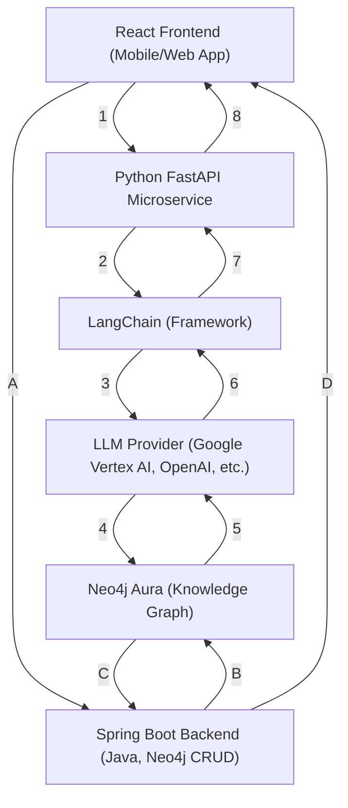

# Agentic Backend (Spring Boot)

This backend powers an agentic AI for healthcare, focused on patient journey tracking, advanced graph reasoning, and microservices architecture using Spring Boot and Neo4j Aura. The project follows a five-step methodology, with industry-standard enhancements and best practices.

---

## System Architecture Diagram (Eraser)


---

## System Architecture Diagram (Prompt Flow)



### Legend
- **React Frontend:** User interface for patients, doctors, admins (mobile/web).
- **Python FastAPI Microservice:** API gateway and orchestration for LLM/agentic features.
- **LangChain (Framework):** Orchestrates prompt flows, agent logic, tool-calling, and connects to LLM providers.
- **LLM Provider:** Google Vertex AI (PaLM, Gemini) or OpenAI for LLM-powered features.
- **Neo4j Aura:** Cloud graph database for healthcare ontology and patient journeys.
- **Spring Boot Backend:** Handles business logic, CRUD, security, and Neo4j graph operations (not in LLM prompt loop).

### Prompt Flow Steps
1. **1:** User prompt sent from frontend to FastAPI microservice.
2. **2:** FastAPI passes prompt to LangChain framework.
3. **3:** LangChain sends prompt to LLM Provider (Vertex/OpenAI).
4. **4:** LLM Provider queries Neo4j Aura if needed.
5. **5:** Neo4j Aura returns result to LLM Provider.
6. **6:** LLM Provider sends processed result to LangChain.
7. **7:** LangChain returns result to FastAPI.
8. **8:** FastAPI returns final answer to frontend.

### CRUD/Business Logic Flow Steps
- **A:** Frontend requests backend to update the DB.
- **B:** Backend talks to DB.
- **C:** DB responds to backend.
- **D:** Backend sends message to frontend.

**Notes:**
- The main prompt flow is indicated by numbered arrows: 1 → 2 → 3 → 4 → 5 → 6 → 7 → 8.
- The CRUD/business logic flow is indicated by letters: A → B → C → D.
- LangChain is now explicitly shown as the orchestration layer between FastAPI and the LLM provider.
- Arrows show both request and response directions for all major API flows.

---

## Five-Step Methodology for Agentic AI Patient Journey Tracking

### **Step 1: Define Use Case and Agent Goals**
**Status:** ✅ Completed
- Use case: Patient Journey Tracking & Alerts
- Agent goals: Personalized information, journey tracking, gap/alert detection, advanced analytics
- Example interactions and agent capabilities are documented

### **Step 2: Design Ontology (Entities, Properties, Relationships, Hierarchies, Tooling)**
**Status:** ✅ Completed (core and advanced design)
- All core entities and property-rich relationships are modeled and implemented:
  - Patient, Doctor, Hospital, Appointment, Diagnosis, Treatment, Medication, Test, Alert
  - Advanced relationship entities (e.g., HasDiagnosis, ReceivesTreatment, TakesMedication, etc.)
- Temporal/event data and journey sub-graph patterns are included
- DTO/Mapper patterns for all entities and relationships
- Full documentation and code examples provided

### **Step 3: Build Neo4j Knowledge Graph (Setup, Data Ingestion, LLM Extraction, Embeddings, GraphRAG, Constraints/Indexes)**
**Status:** 🟡 Partially Completed
- Neo4j Aura instance set up and connected
- DataInitializer creates and links all core and advanced ontology entities/relationships
- DTOs and mappers implemented for clean data transfer
- LLM extraction with Pydantic schemas documented (not yet fully integrated)
- Embeddings and GraphRAG patterns documented (not yet implemented)

### **Step 4: Develop Agentic AI Architecture (LLM Integration, Agent Frameworks, Tools, Memory, Reasoning)**
**Status:** 🟡 Documented, Implementation Pending
- Approach and rationale documented
- No code for LLM/agent integration, memory, or reasoning yet

### **Step 5: Iteration and Refinement (Testing, Prompt Engineering, Ontology Evolution, Performance)**
**Status:** 🟡 Ongoing
- Iteration, prompt engineering, and ontology evolution are documented as ongoing
- Testing and optimization are in progress

---

## Enhancements Required for Full Industry-Standard Solution

To achieve a fully functional, industry-grade agentic AI for patient journey tracking, the following enhancements are recommended:

1. **LLM/Agent Integration (Step 4 Implementation)**
   - Implement LLM integration (e.g., LangChain, LlamaIndex)
   - Develop agent tool definitions, memory, and reasoning modules
   - Provide working examples of LLM-driven extraction, QA, and planning over the graph

2. **Unstructured Data Ingestion**
   - Implement pipeline for ingesting unstructured data (e.g., clinical notes) using LLMs and Pydantic schemas
   - Automate entity/relation extraction and graph population

3. **Embeddings & GraphRAG**
   - Implement embeddings for semantic search and retrieval-augmented generation
   - Provide endpoints or agent tools for semantic search over the knowledge graph

4. **Event-Driven/Real-Time Capabilities**
   - Add support for real-time event processing (e.g., Kafka, WebSockets) for alerts, reminders, and patient status updates

5. **Frontend/UX & API Documentation**
   - Add minimal frontend or API documentation (Swagger/OpenAPI) for user interaction and journey visualization

6. **Testing & Validation**
   - Add automated unit, integration, and contract tests (JUnit, Mockito, Testcontainers)
   - Use validation annotations on DTOs and request bodies

7. **Observability & Security**
   - Integrate logging, tracing, and monitoring (Spring Boot Actuator, Prometheus, Grafana)
   - Enhance security (OAuth2/JWT, audit logging)
   - Ensure compliance (HIPAA/GDPR) for production

---

## Step-by-Step Details and Documentation

### Step 1: Use Case and Agent Goals
- **Completed:** The use case for Patient Journey Tracking & Alerts has been defined, with clear agent goals for personalized information, journey tracking, gap/alert detection, and advanced analytics. Example interactions and agent capabilities have been documented.

### Step 2: Ontology Design
- **Completed:** The ontology has been designed with all core entities (Patient, Doctor, Hospital, Appointment, Diagnosis, Treatment, Medication, Test, Alert) and advanced property-rich relationships (e.g., HasDiagnosis, ReceivesTreatment, TakesMedication). Temporal and event data, as well as journey sub-graph patterns, have been included. DTO and Mapper patterns are implemented for all entities and relationships, with comprehensive documentation and code examples provided.

### Step 3: Neo4j Knowledge Graph Setup
- **In Progress:** The Neo4j Aura instance has been set up and connected. The DataInitializer creates and links all core and advanced ontology entities and relationships. DTOs and mappers are implemented for clean data transfer. LLM extraction with Pydantic schemas is documented but not yet fully integrated. Embeddings and GraphRAG patterns are documented but not yet implemented.

### Step 4: Agentic AI Architecture
- **Documented, Implementation Pending:** The approach and rationale for LLM integration, agent frameworks, tools, memory, and reasoning have been documented. However, no code for LLM/agent integration, memory, or reasoning has been implemented yet.

### Step 5: Iteration and Refinement
- **Ongoing:** Iteration, prompt engineering, and ontology evolution are ongoing. Testing and optimization are in progress.

---

## Best Practices and Industry Alignment

- **Separation of Concerns:** DTOs and mappers decouple API and persistence models
- **Property-Rich Relationships:** Use of @RelationshipProperties for expressive, queryable graphs
- **Spring Data Neo4j:** Standard repository and annotation usage
- **Security:** Basic authentication and endpoint protection
- **Microservices & Monorepo:** NX monorepo structure and microservice separation
- **Documentation:** Comprehensive, beginner-friendly, and covers setup, troubleshooting, and best practices

**For enterprise/industry-grade solutions, also ensure:**
- Automated testing and validation
- API documentation (Swagger/OpenAPI)
- Observability and monitoring
- Advanced security and compliance
- CI/CD pipelines

---

## Appendix: Example Code, Patterns, and Usage

# Agentic Backend (Spring Boot)

This folder contains the Spring Boot microservice(s) for the Agentic AI project, focused on healthcare domain ontologies and graph reasoning using Neo4j Aura. "graph reasoning" is about using Neo4j Aura to go beyond simple data storage—it's about understanding and utilizing the rich, connected nature of your healthcare data to power intelligent features and analytics.

## Getting Started
1. Scaffold a new Spring Boot project (using Spring Initializr or your preferred method) inside this folder.
2. Add the following dependencies to your `pom.xml` or `build.gradle`:
   - `spring-boot-starter-data-neo4j`
   - `spring-boot-starter-web`
3. Configure Neo4j Aura connection in `application.properties`:
   ```properties
   spring.neo4j.uri=neo4j+s://<your-neo4j-uri>
   spring.neo4j.authentication.username=<username>
   spring.neo4j.authentication.password=<password>
   ```
4. Implement ontology models and services for healthcare knowledge graphs, including:
   - Patient, Doctor, Hospital (core entities)
   - Appointment, Diagnosis, Treatment, Medication, Test, Alert (event and process entities)
   - Relationships and temporal data to track patient journeys and healthcare events.  
     _Example: An appointment relationship can include a `date` property (e.g., `HAS_APPOINTMENT {date: '2025-06-14'}`), or a diagnosis relationship can include a `diagnosedDate` property (e.g., `HAS_DIAGNOSIS {diagnosedDate: '2025-06-01'}`) to capture when events occurred in the patient journey._

## Sample Neo4j Configuration (application.properties)
```
spring.neo4j.uri=neo4j+s://<your-neo4j-uri>
spring.neo4j.authentication.username=<username>
spring.neo4j.authentication.password=<password>
```

## Sample Entity Classes

### Patient.java
```java
package com.agentic.agentic_backend.model;

import org.springframework.data.neo4j.core.schema.Id;
import org.springframework.data.neo4j.core.schema.Node;

@Node
public class Patient {
    @Id
    private String id;
    private String name;
    private String gender;
    private int age;
    // Add more fields as needed
}
```

### Doctor.java
```java
package com.agentic.agentic_backend.model;

import org.springframework.data.neo4j.core.schema.Id;
import org.springframework.data.neo4j.core.schema.Node;

@Node
public class Doctor {
    @Id
    private String id;
    private String name;
    private String specialty;
    // Add more fields as needed
}
```

### Hospital.java
```java
package com.agentic.agentic_backend.model;

import org.springframework.data.neo4j.core.schema.Id;
import org.springframework.data.neo4j.core.schema.Node;

@Node
public class Hospital {
    @Id
    private String id;
    private String name;
    private String location;
    // Add more fields as needed
}
```

## Example Use Case: Healthcare Information Retrieval, Referral, & Patient Journey Tracking Agent

This backend powers an Agentic AI that helps patients and doctors find the right healthcare resources and track the entire patient journey using a knowledge graph. The core entities are Patient, Doctor, and Hospital, but the system also models appointments, diagnoses, treatments, medications, tests, alerts, and all the relationships and events that make up a patient's healthcare journey.

### Agent Goals
- Provide accurate, personalized information and referral suggestions based on patient queries and healthcare data.
- Track and analyze the full patient journey, including appointments, diagnoses, treatments, medications, tests, and alerts.
- Identify gaps in care, overdue follow-ups, missed medications, and trigger alerts or recommendations for both patients and providers.
- Enable advanced queries and analytics over the patient journey graph to support proactive, personalized healthcare.

### Agent Capabilities
- Understand patient queries about medical conditions, doctor specialties, hospital services, and preferences.
- Retrieve relevant doctors/hospitals by specialty, location, availability, or insurance.
- Access (simulated) patient records: demographics, history, medications.
- Provide doctor/hospital details: contact, qualifications, working hours, insurance.
- Suggest referrals and explain recommendations.

### Example Interactions
- "I need a cardiologist near Colombo."
- "Which hospitals accept Ceylinco Insurance?"
- "What are Dr. Perera's working hours at Lanka Hospital?"
- "Show me the medical history of John Doe."
- "Who is the primary care physician for Mary Jones?"

## Patient Journey Tracking & Alerts Use Case

This backend powers an Agentic AI that tracks a patient's journey through diagnosis, treatment, and recovery, identifying potential issues and triggering alerts or recommendations.

### Ontology Highlights
- **Entities:** Patient, Doctor, Hospital, Appointment, Diagnosis, Treatment, Medication, Test, Alert
- **Relationships:**
  - Patient hasAppointment Appointment
  - Appointment with Doctor
  - Appointment at Hospital
  - Appointment hasDiagnosis Diagnosis
  - Diagnosis leadsTo Treatment
  - Treatment involves Medication
  - Appointment hasTest Test
  - Alert for Patient/Doctor
- **Temporal Data:** Timestamps for events, status (scheduled, completed, missed), and event sequences

### Agent Goals
- Track appointments, treatments, and medication adherence
- Identify missing follow-ups or overdue tests
- Trigger alerts to doctors or nurses for critical events (e.g., missed medication, abnormal test results)
- Provide patients with reminders and next steps

### Example Interactions
- "Show me the upcoming appointments for John Doe."
- "Alert if a patient misses a medication dose."
- "What treatments has Mary Jones received for her diagnosis?"
- "List overdue tests for all patients."
- "Send a reminder to Dr. Perera for a follow-up appointment."

## Example: Patient Journey Sub-Graph

Below is an example of how a patient journey can be represented as a sub-graph in Neo4j:

```
(Patient:Patient {name: 'John Doe'})
  -[:HAS_DIAGNOSIS {diagnosedDate: '2024-01-15'}]-> (Diagnosis:Diagnosis {name: 'Hypertension'})
  -[:CARED_FOR_BY]-> (Doctor:Doctor {name: 'Dr. Jane Smith', specialty: 'General Physician'})
  -[:HAS_APPOINTMENT {date: '2024-01-20', type: 'Consultation', status: 'Completed'}]-> (Appointment:Appointment)
    -[:WITH_DOCTOR]-> (Doctor)
    -[:AT_HOSPITAL]-> (Hospital:Hospital {name: 'City General Hospital'})

(Doctor)-[:PRESCRIBED {date: '2024-01-20'}]-> (Medication:Medication {drugName: 'Lisinopril', dosage: '10mg', frequency: 'Once daily'})
(Patient)-[:TAKES_MEDICATION {prescribedDate: '2024-01-20', adherence: 'Compliant'}]-> (Medication)
  -[:FOR_DIAGNOSIS]-> (Diagnosis)

(Patient)-[:HAS_APPOINTMENT {date: '2024-02-20', type: 'Follow-up', status: 'Scheduled'}]-> (Appointment:Appointment)
  -[:WITH_DOCTOR]-> (Doctor)
  -[:AT_HOSPITAL]-> (Hospital)
  -[:FOLLOWS_UP]-> (Treatment:Treatment {name: 'Hypertension Management'})
```

This sub-graph demonstrates:
- How a patient's diagnosis, appointments, treatments, and medication are connected.
- How relationships can have properties (e.g., diagnosedDate, adherence, appointment status).
- How the journey is tracked over time and across different healthcare events.

## Example: Appointment Ontology Entity

The `Appointment` class is a core ontology entity in this project, modeled as a Neo4j node using Spring Data Neo4j. This class demonstrates how both nodes and edges (relationships) are represented in the code and persisted in the graph database.

```java
@Node
public class Appointment {
    @Id
    private String appointmentId;
    private String date;
    private String type;
    private String status;

    @Relationship(type = "WITH_DOCTOR")
    private Doctor doctor;

    @Relationship(type = "AT_HOSPITAL")
    private Hospital hospital;

    @Relationship(type = "HAS_DIAGNOSIS")
    private List<Diagnosis> diagnoses;

    @Relationship(type = "HAS_TEST")
    private List<Test> tests;

    // getters and setters
}
```

**Explanation:**  
- The `@Node` annotation makes `Appointment` a node in the Neo4j graph.  
- Fields like `date`, `type`, and `status` store appointment details.  
- The `@Relationship` annotations define edges from the `Appointment` node to other nodes (`Doctor`, `Hospital`, `Diagnosis`, `Test`).  
- When an `Appointment` object is created and saved with related entities, Spring Data Neo4j will create both the node and the corresponding relationships (edges) in the database.  
- This approach allows you to model complex healthcare journeys, connecting appointments to doctors, hospitals, diagnoses, and tests, enabling advanced queries and reasoning in your knowledge graph.

## Security Configuration

The backend uses Spring Security to protect its endpoints. By default, all endpoints require authentication except for the Neo4j health check endpoint, which is publicly accessible for monitoring and testing purposes.

**Key points:**
- The `/api/neo4j/health` endpoint is open to everyone (no authentication required).
- All other endpoints require HTTP Basic authentication.
- CSRF protection is disabled for simplicity in API use cases. This means the backend does not enforce Cross-Site Request Forgery (CSRF) security checks on its endpoints. For REST APIs that are not accessed directly from browsers, disabling CSRF is generally safe and makes it easier to use tools like Postman or frontend/mobile apps. If you build browser-based forms that use cookies for authentication, you should enable CSRF protection.
- The security configuration is defined in `SecurityConfig.java`:

```java
@Configuration
public class SecurityConfig {
    @Bean
    public SecurityFilterChain filterChain(HttpSecurity http) throws Exception {
        http
            .authorizeHttpRequests(authz -> authz
                .requestMatchers("/api/neo4j/health").permitAll()
                .anyRequest().authenticated())
            .csrf().disable()
            .httpBasic();
        return http.build();
    }
}
```

**How it works:**  
When the application starts (by default on port 8080), you can access the health check endpoint at `http://localhost:8080/api/neo4j/health` without authentication. Any other API requests will prompt for a username and password, using Spring Boot's default security settings unless you configure custom users.

## Neo4j Connection Testing

To verify that your Spring Boot backend can connect to Neo4j Aura, a health check endpoint is provided:

- The `/api/neo4j/health` endpoint runs a simple Cypher query (`RETURN 1 AS result`) against your Neo4j instance.
- If the connection is successful, it returns `Neo4j connection OK.`
- If the connection fails, it returns an error message.

**How to use:**
1. Start your backend application (by default on port 8080).
2. Visit [http://localhost:8080/api/neo4j/health](http://localhost:8080/api/neo4j/health) in your browser or Postman.
3. You should see `Neo4j connection OK.` if the connection is working.

This endpoint is publicly accessible for monitoring and testing, as configured in the security settings.

# Ontology Entities and Microservices Architecture Documentation

## Ontology Entities

In this project, the following classes are considered **ontology entities**:
- Patient
- Doctor
- Hospital
- Appointment
- Diagnosis
- Treatment
- Medication
- Test
- Alert

These entities represent real-world healthcare concepts and are modeled as nodes in the Neo4j graph database. Each entity is annotated with `@Node` and may have relationships to other entities, reflecting the semantic structure of the healthcare domain. This approach enables advanced queries and reasoning about patient journeys, diagnoses, treatments, and more.

### Example: Patient Entity
```java
@Node
public class Patient {
    @Id
    private String patientId;
    private String name;
    private String dob;
    private String gender;
    // ...other fields...
    @Relationship(type = "HAS_APPOINTMENT")
    private List<Appointment> appointments;
    @Relationship(type = "HAS_DIAGNOSIS")
    private List<Diagnosis> diagnoses;
    // ...
}
```

## Microservices Architecture and Design Patterns

- The backend is structured as a Spring Boot microservice, following microservices architecture principles.
- Each major domain concept is modeled as a separate entity, supporting domain-driven design.
- Repository interfaces are created for each entity, following the repository pattern for clean separation of data access logic.
- Security is managed centrally using Spring Security, with public and protected endpoints.
- The project is organized using NX monorepo best practices, with all backend code under `apps/agentic-backend/` and shared code in `libs/` (if needed).

## Important Note: How Data is Created in Neo4j vs Relational Databases

In traditional Spring Boot applications with relational databases (using JPA):
- Defining an `@Entity` class and a repository sets up the table structure.
- If `spring.jpa.hibernate.ddl-auto` is set to `update` or `create`, tables are auto-created.
- **However, rows (data) are only created when you save entities using the repository.**

In Spring Data Neo4j (for graph databases):
- Defining a `@Node` class and a repository sets up the structure for nodes and relationships.
- **Neo4j does NOT auto-create nodes or relationships just because the class exists.**
- **Nodes and relationships are only created when you save objects using the repository (e.g., `appointmentRepository.save(...)`).**
- Neo4j is schema-optional: it does not require or create a schema for nodes/relationships up front, and it does not create any data until you explicitly save it.

### Why is this?
- Neo4j is about modeling and querying relationships, not just storing isolated records.
- You must create and save objects that reference each other (e.g., an `Appointment` with a `Doctor`, `Patient`, etc.) to create both nodes and their relationships in the graph.
- Neo4j will only show nodes and relationships that have actually been persisted via your repositories.

**Summary:**
- In both JPA and Neo4j, the entity/repo setup only defines the structure.
- **Actual data (rows in SQL, nodes in Neo4j) is only created when you save objects using the repository.**
- Neo4j does not create "empty" nodes for you; you must save data to see nodes in the database.

**To see nodes and relationships in Neo4j:**
- You need to save objects with their relationships set (e.g., `appointment.setDoctor(doctor)`), then call `appointmentRepository.save(appointment)`.

## Neo4j Deprecation Warning: `id()` vs `elementId()`

When running the backend and initializing data, you may see a warning like this in the logs:

```
The query used a deprecated function. ('id' has been replaced by 'elementId or an application-generated id')
Neo.ClientNotification.Statement.FeatureDeprecationWarning: This feature is deprecated and will be removed in future versions.
... WHERE id(endNode) = relationship.toId ...
```

**What does this mean?**
- This warning is generated by Neo4j and Spring Data Neo4j because the framework's generated Cypher queries use the deprecated `id()` function to reference node IDs.
- Neo4j now recommends using `elementId()` or your own application-generated IDs for referencing nodes.
- Your data is still being created and relationships are working as expected.

**What should you do?**
- You do not need to change your code right now. This is a framework-level issue, not a problem with your entity or repository code.
- Always use your own unique IDs (like `patientId`, `doctorId`, etc.) for lookups and relationships, not the internal Neo4j `id()`.

## Data Initializer: Sample Data Creation on Startup

This project includes a `DataInitializer` class that automatically creates and saves sample nodes and relationships in Neo4j when the backend application starts. This is useful for onboarding, testing, and demonstration purposes.

**How it works:**
- The `DataInitializer` implements `CommandLineRunner` and is annotated with `@Component`, so it runs at application startup.
- It creates and saves:
  - A `Doctor` node
  - A `Hospital` node
  - A `Diagnosis` node
  - An `Appointment` node (linked to the doctor, hospital, and diagnosis)
  - A `Patient` node (linked to the appointment and diagnosis)
  - A `Treatment` node (linked to diagnosis and/or appointment)
  - A `Medication` node (linked to treatment and/or patient)
  - A `Test` node (linked to appointment and/or patient)
  - An `Alert` node (linked to patient and/or doctor)
- All relationships (edges) are set in Java before saving, so Neo4j will persist both the nodes and their connections.
- After initialization, a log message is printed: `Sample data initialized: Patient, Doctor, Hospital, Diagnosis, Appointment, Treatment, Medication, Test, Alert nodes and relationships created in Neo4j.`

**How to use:**
1. Start the backend application with `./mvnw spring-boot:run` (or `mvnw.cmd spring-boot:run` on Windows).
2. On startup, the sample data will be created automatically if it does not already exist.
3. You can view the created nodes and relationships in your Neo4j instance.

**Example (simplified):**
```java
@Component
public class DataInitializer implements CommandLineRunner {
    @Override
    public void run(String... args) {
        // ... create Doctor, Hospital, Diagnosis ...
        // ... create Appointment and link to Doctor, Hospital, Diagnosis ...
        // ... create Patient and link to Appointment, Diagnosis ...
        // ... create Treatment, Medication, Test and link appropriately ...
        // ... save all using repositories ...
        System.out.println("Sample data initialized: Patient, Doctor, Hospital, Diagnosis, Appointment, Treatment, Medication, Test, Alert nodes and relationships created in Neo4j.");
    }
}
```

This ensures that your Neo4j database is populated with a realistic mini-graph for immediate exploration and development, including all 9 ontology entities: Patient, Doctor, Hospital, Appointment, Diagnosis, Treatment, Medication, Test, and Alert.

## Neo4j Aura User Roles & Permissions

**Important:** To allow the backend to create and view nodes/relationships in Neo4j Aura, your database user must have at least the `editor` or `admin` role. The default `PUBLIC` or `reader` roles are read-only and will result in errors such as:

```
Failed to check Neo4j version. Application supports Neo4j versions >= 4.4.0. Connecting to an unsupported version may lead to incompatibilities, reduced functionality, unexpected bugs, and other issues. Error: Executing procedure is not allowed for user ... with roles [PUBLIC] overridden by READ.
```

### How to Fix
1. Log in to the [Neo4j Aura Console](https://console.neo4j.io/).
2. Go to your database > Users tab.
3. Ensure your user has the `editor` or `admin` role.
4. Update your `application.yml` with the correct username and password.
5. Restart the backend application.

**Security Note:** For development, `editor` is sufficient. Never use the `admin` user in production code.

### Troubleshooting
- If you cannot see nodes in Neo4j or get permission errors, check your user role and credentials.
- If you see an error like:
  ```
  Failed to check Neo4j version. Application supports Neo4j versions >= 4.4.0. Connecting to an unsupported version may lead to incompatibilities, reduced functionality, unexpected bugs, and other issues. Error: Executing procedure is not allowed for user ... with roles [PUBLIC] overridden by READ.
  ```
  This usually means you are connecting with insufficient permissions (the default PUBLIC/reader role). To fix this in Neo4j Aura, use the "Connect with credentials" option and copy the generated token for the neo4j user into your application's configuration (e.g., `application.yml`). This will ensure you have the correct permissions to create and view nodes and relationships.
- After updating credentials, you should be able to see all nodes and relationships created by the backend.

## DTOs (Data Transfer Objects): Beginner-Friendly Explanation and Example

### What is a DTO?
A **DTO (Data Transfer Object)** is a simple Java class used to transfer data between different parts of an application, especially between the backend and the frontend (API clients). DTOs are not database entities—they are designed to represent only the data you want to expose or accept via your API.

### Why Use DTOs?
- **Security:** Hide sensitive or internal fields from API consumers. Only expose what is needed.
- **Decoupling:** Changes to your database/entity model do not break your API contract.
- **Performance:** Prevent sending large or deeply nested object graphs (e.g., avoid infinite loops from circular relationships).
- **Validation:** Use DTOs to validate incoming data before mapping to your internal model.
- **Flexibility:** Shape the API response to fit frontend needs (e.g., flatten, aggregate, or rename fields).

### Example: Patient Entity vs PatientDTO

Suppose your `Patient` entity (used for Neo4j persistence) looks like this:
```java
@Node
public class Patient {
    @Id
    private String patientId;
    private String name;
    private String dob;
    private String gender;
    private List<Appointment> appointments; // relationships
    private List<Diagnosis> diagnoses;      // relationships
    // ...other fields and relationships...
}
```

If you expose this entity directly via your REST API, the response might include all fields, including relationships and internal data. This can:
- Leak sensitive or unnecessary information
- Cause performance issues (large nested objects)
- Lead to infinite recursion in JSON serialization (circular references)

**With DTOs, you control what is sent to the client.**

A `PatientDTO` might look like:
```java
public class PatientDTO {
    private String patientId;
    private String name;
    private String dob;
    private String gender;
    // No relationships or internal fields
}
```

**API Response Example:**
```json
{
  "patientId": "p123",
  "name": "John Doe",
  "dob": "1980-01-01",
  "gender": "male"
}
```

### What Fields Are Filtered?
- Any field present in the entity but **not** in the DTO is filtered out (not sent to the client).
- For example, `appointments` and `diagnoses` are present in `Patient` but not in `PatientDTO`, so they are not exposed in the API response.

### How Does Mapping Work?
A **Mapper** class converts between your entity and DTO:
```java
public class PatientMapper {
    public static PatientDTO toDTO(Patient patient) {
        if (patient == null) return null;
        PatientDTO dto = new PatientDTO();
        dto.setPatientId(patient.getPatientId());
        dto.setName(patient.getName());
        dto.setDob(patient.getDob());
        dto.setGender(patient.getGender());
        return dto;
    }
}
```

### Summary Table
| Entity Field      | In DTO? | Exposed to API? |
|-------------------|---------|-----------------|
| patientId         | Yes     | Yes             |
| name              | Yes     | Yes             |
| dob               | Yes     | Yes             |
| gender            | Yes     | Yes             |
| appointments      | No      | No              |
| diagnoses         | No      | No              |
| ...other fields   | No      | No              |

### Best Practices
- Always use DTOs for API input/output, not your entity classes.
- Only include fields in the DTO that you want to expose or accept.
- Use mappers to convert between entities and DTOs.
- Validate incoming DTOs before mapping to entities.

### Where to Find DTOs and Mappers in This Project
- DTOs: `apps/agentic-backend/src/main/java/com/agentic/agentic_backend/model/*DTO.java`
- Mappers: `apps/agentic-backend/src/main/java/com/agentic/agentic_backend/model/*Mapper.java`

This approach is used for all ontology entities (Patient, Doctor, Hospital, Appointment, Diagnosis, Treatment, Medication, Test, Alert) in this project.

---

## Visualizing All Nodes and Relationships in Neo4j

To see all nodes and their relationships in your Neo4j database, use one of the following methods:

### 1. Neo4j Browser (Web UI)
- Open the Neo4j Browser (usually at https://<your-neo4j-instance>:7474).
- Run this Cypher query to display all nodes and relationships:
  ```
  MATCH (n)-[r]->(m) RETURN n, r, m
  ```
  Or, to include isolated nodes (without relationships):
  ```
  MATCH (n) OPTIONAL MATCH (n)-[r]->(m) RETURN n, r, m
  ```
- This will show a graph visualization of all nodes and their relationships.

### 2. Neo4j Bloom (Advanced Visualization)
- If you have access to Neo4j Bloom, you can use it for more advanced and user-friendly graph exploration.
- You can search for `*` or use patterns to explore the graph visually.

### 3. Cypher Shell/CLI
- You can run the same Cypher queries from the Neo4j Cypher Shell or any Neo4j client.

### 4. Programmatically (Spring Data)
- You can expose a REST endpoint in your Spring Boot app to run a custom Cypher query and return the results, but for visualization, the Neo4j Browser is the best tool.

**Tip:** For large graphs, you may want to limit the number of nodes:
```
MATCH (n)-[r]->(m) RETURN n, r, m LIMIT 100
```

---

## DataInitializer: Property-Rich Relationship Entities

The `DataInitializer` class now demonstrates how to create and persist property-rich relationship entities for advanced patient journey tracking. Instead of simple direct relationships, the following relationship entities are used:
- `HasDiagnosis` (with `diagnosedDate`)
- `ReceivesTreatment` (with `startDate`, `endDate`)
- `TakesMedication` (with `prescribedDate`, `adherence`)
- `HasAppointment` (with `appointmentDate`, `appointmentType`, `status`)
- `UnderwentTest` (with `performedDate`)
- `AdmittedTo` (with `admissionDate`, `dischargeDate`)
- `CaredForBy` (with `startDate`)

**Example (simplified):**
```java
// Relationship entities for Patient
HasDiagnosis hasDiagnosis = new HasDiagnosis();
hasDiagnosis.setDiagnosedDate("2024-01-15");
hasDiagnosis.setDiagnosis(diagnosis);

ReceivesTreatment receivesTreatment = new ReceivesTreatment();
receivesTreatment.setStartDate("2024-01-21");
receivesTreatment.setEndDate("2024-06-21");
receivesTreatment.setTreatment(treatment);

TakesMedication takesMedication = new TakesMedication();
takesMedication.setPrescribedDate("2024-01-20");
takesMedication.setAdherence("Compliant");
takesMedication.setMedication(medication);

// ... other relationship entities ...

Patient patient = new Patient();
patient.setHasDiagnoses(Collections.singletonList(hasDiagnosis));
patient.setReceivesTreatments(Collections.singletonList(receivesTreatment));
patient.setTakesMedications(Collections.singletonList(takesMedication));
// ... set other relationships ...
patientRepository.save(patient);
```

This approach enables modeling of property-rich relationships, supporting advanced queries and analytics for patient journey tracking.

---

## Doctor Relationships: Property-Rich Relationship Entities

The ontology and backend now support advanced, property-rich relationships for the Doctor entity, enabling detailed modeling of a doctor's activities and interactions in the healthcare graph. The following relationship entities are used:

- **PRACTICES_AT**: `Doctor --(startDate: date)--> Hospital`
- **PERFORMED**: `Doctor --(performedDate: date)--> Treatment`
- **ORDERED**: `Doctor --(orderedDate: date)--> Test`
- **PRESCRIBED**: `Doctor --(prescribedDate: date)--> Medication`
- **CONSULTED**: `Doctor --(consultationDate: date)--> Patient` (or link to an Appointment node)

Each of these is represented by a dedicated class annotated with `@RelationshipProperties`, and referenced in the `Doctor` class as a list or collection. This enables queries such as:
- Which hospitals has a doctor practiced at, and when?
- What treatments has a doctor performed?
- What tests has a doctor ordered?
- What medications has a doctor prescribed?
- Which patients (or appointments) has a doctor consulted, and when?

**Example usage in the Doctor model:**
```java
@Relationship(type = "PRACTICES_AT")
private List<PracticesAt> practicesAts;
@Relationship(type = "PERFORMED")
private List<Performed> performeds;
@Relationship(type = "ORDERED")
private List<Ordered> ordereds;
@Relationship(type = "PRESCRIBED")
private List<Prescribed> prescribeds;
@Relationship(type = "CONSULTED")
private List<Consulted> consulteds;
```

**Example relationship property class:**
```java
@RelationshipProperties
public class PracticesAt {
    @Id @GeneratedValue
    private Long id;
    private String startDate;
    @TargetNode
    private Hospital hospital;
    // ...
}
```

This approach enables rich, queryable, and property-rich relationships for the Doctor node, supporting advanced analytics and patient journey tracking.

---

## Hospital Relationships: Property-Rich Relationship Entities

The Hospital node now supports advanced, property-rich relationships for a more expressive healthcare graph. These relationships are modeled using `@RelationshipProperties` classes, allowing you to store additional data on the edge itself. The following relationships are implemented:

- **OFFERS_SERVICE**: `Hospital --(serviceName: name)--> Service` (see `OffersService`)
- **HAS_DEPARTMENT**: `Hospital --(:HAS_DEPARTMENT)--> Department` (see `HasDepartment`)
- **HOSTS**: `Hospital --(:HOSTS)--> Appointment` (see `Hosts`)
- **PERFORMED_AT**: `Treatment --(performedDate: date)--> Hospital` (see `PerformedAt`)
- **CONDUCTED_AT**: `Test --(performedDate: date)--> Hospital` (see `ConductedAt`)

Each of these is represented by a dedicated class annotated with `@RelationshipProperties`, and referenced in the relevant node class as a list or collection. This enables queries such as:
- What services does a hospital offer?
- What departments exist in a hospital?
- Which appointments are hosted at a hospital?
- Where was a treatment performed?
- Where was a test conducted?

**Example usage in the Hospital model:**
```java
@Relationship(type = "OFFERS_SERVICE")
private List<OffersService> offersServices;
@Relationship(type = "HAS_DEPARTMENT")
private List<HasDepartment> hasDepartments;
@Relationship(type = "HOSTS")
private List<Hosts> hosts;
```

**Example relationship property class:**
```java
@RelationshipProperties
public class OffersService {
    @Id @GeneratedValue
    private Long id;
    private String serviceName;
    @TargetNode
    private Service service;
    // ...
}
```

This approach enables rich, queryable, and property-rich relationships for the Hospital node, supporting advanced analytics and healthcare resource modeling.

---

## Understanding @Node vs @RelationshipProperties in Spring Data Neo4j

- `@Node` is used to annotate classes that represent entities (nodes) in the Neo4j graph, such as `Patient`, `Doctor`, `Hospital`, `Alert`, etc. These are the main data objects in your domain.
- `@RelationshipProperties` is used to annotate classes that represent property-rich relationships (edges) between nodes. These classes are not nodes themselves, but allow you to store additional data on the relationship, such as dates, status, or other attributes.

### Example: Node vs RelationshipProperties

```java
@Node
public class Alert {
    @Id
    private String alertId;
    // ... fields ...
    @Relationship(type = "FOR_PATIENT")
    private Patient patient;
    @Relationship(type = "FOR_DOCTOR")
    private Doctor doctor;
    // ...
}
```
- Here, `Alert` is a node with simple relationships to `Patient` and `Doctor`. These relationships do not have extra properties, so no `@RelationshipProperties` class is needed.

```java
@RelationshipProperties
public class HasAppointment {
    @Id @GeneratedValue
    private Long id;
    private String appointmentDate;
    private String appointmentType;
    private String status;
    @TargetNode
    private Appointment appointment;
    // ...
}
```
- Here, `HasAppointment` is a property-rich relationship between a `Patient` and an `Appointment`, storing extra data about the relationship itself.

### How to Identify Nodes with Property-Rich Relationships
- Look for fields in your `@Node` classes that are of a type annotated with `@RelationshipProperties` (not another `@Node`).
- These fields represent relationships with properties (property-rich relationships).
- The properties are defined in the `@RelationshipProperties` class, not on the node itself.

### Summary Table
| Annotation                | Purpose                                  | Example Classes                |
|---------------------------|------------------------------------------|-------------------------------|
| `@Node`                   | Graph node/entity                        | Patient, Doctor, Alert, etc.  |
| `@RelationshipProperties` | Property-rich relationship (edge) class  | HasAppointment, CaredForBy, etc. |

- Nodes with fields referencing `@RelationshipProperties` classes have property-rich relationships.
- Simple relationships (without extra properties) are just annotated with `@Relationship` and point to another `@Node` class.
- If you need to store data on a relationship, use a `@RelationshipProperties` class.

---

## Event/Journey Relationships: Property-Rich Relationship Entities

The ontology now supports advanced event/journey relationships for tracking the flow of healthcare events and patient journeys. These relationships are modeled using `@RelationshipProperties` classes, allowing you to store additional data on the edge itself. The following relationships are implemented:

- **RESULTED_IN**: `Test --(resultImpact: impact)--> Diagnosis` (see `ResultedIn`)
- **FOR_DIAGNOSIS**: `Treatment --(:FOR_DIAGNOSIS)--> Diagnosis` (see `ForDiagnosis`)
- **FOR_TREATMENT**: `Medication --(:FOR_TREATMENT)--> Treatment` (see `ForTreatment`)
- **LEADS_TO**: `Diagnosis --(:LEADS_TO)--> Treatment` (see `LeadsTo`)
- **FOLLOWS_UP**: `Appointment --(:FOLLOWS_UP)--> Treatment or Diagnosis` (see `FollowsUp`)

Each of these is represented by a dedicated class annotated with `@RelationshipProperties`, and referenced in the relevant node class as a list or collection. This enables queries such as:
- Which test results led to which diagnoses?
- What treatments are for which diagnoses?
- Which medications are for which treatments?
- What are the recommended treatment pathways for a diagnosis?
- Which appointments are follow-ups for treatments or diagnoses?

**Example usage in the model classes:**
```java
// In Test.java
@Relationship(type = "RESULTED_IN")
private List<ResultedIn> resultedIns;

// In Diagnosis.java
@Relationship(type = "LEADS_TO")
private List<LeadsTo> leadsTos;

// In Treatment.java
@Relationship(type = "FOR_DIAGNOSIS")
private List<ForDiagnosis> forDiagnoses;
@Relationship(type = "FOR_TREATMENT")
private List<ForTreatment> forTreatments;

// In Medication.java
@Relationship(type = "FOR_TREATMENT")
private List<ForTreatment> forTreatments;

// In Appointment.java
@Relationship(type = "FOLLOWS_UP")
private List<FollowsUp> followsUps;
```

**Example relationship property class:**
```java
@RelationshipProperties
public class ResultedIn {
    @Id @GeneratedValue
    private Long id;
    private String resultImpact;
    @TargetNode
    private Diagnosis diagnosis;
    // ...
}
```

This approach enables rich, queryable, and property-rich event/journey relationships, supporting advanced analytics and patient journey tracking in the healthcare graph.

---

## Example: Property-Rich Relationship DTO and Mapper

To expose property-rich relationships (such as `LeadsTo`) in your API, use DTO and Mapper classes. This ensures only the necessary data is sent to the client and avoids exposing internal model details.

**LeadsToDTO.java**
```java
public class LeadsToDTO {
    private Long id;
    private String treatmentId;
    private String treatmentName;
    // getters and setters
}
```

**LeadsToMapper.java**
```java
public class LeadsToMapper {
    public static LeadsToDTO toDTO(LeadsTo leadsTo) {
        if (leadsTo == null) return null;
        LeadsToDTO dto = new LeadsToDTO();
        dto.setId(leadsTo.getId());
        if (leadsTo.getTreatment() != null) {
            dto.setTreatmentId(leadsTo.getTreatment().getTreatmentId());
            dto.setTreatmentName(leadsTo.getTreatment().getName());
        }
        return dto;
    }
}
```


This pattern is used for all property-rich relationship entities in the ontology (such as `ResultedIn`, `ForDiagnosis`, `ForTreatment`, `FollowsUp`, etc.), ensuring clean API responses and separation of concerns.

---

## System Architecture Diagram (High-Level)


**With:**
````markdown
```mermaid
graph TD
    A[React Frontend (Mobile/Web App)] --> B[Spring Boot Backend (Java, Neo4j CRUD)]
    B --> C[Python FastAPI Microservice (LLM/Agentic AI)]
    C <--> D[LLM Provider (Google Vertex AI, OpenAI, etc.)]
    B --> E[Neo4j Aura (Knowledge Graph)]
    C --> E
```

**Legend:**
- **React Frontend:** User interface for patients, doctors, admins (mobile/web).
- **Spring Boot Backend:** Handles business logic, CRUD, security, and Neo4j graph operations.
- **Python FastAPI Microservice:** Handles LLM/agentic AI features, prompt processing, and advanced reasoning.
- **Neo4j Aura:** Cloud graph database for healthcare ontology and patient journeys.
- **LLM Provider:** Google Vertex AI (PaLM, Gemini) or OpenAI for LLM-powered features.

**Notes:**
- The arrow between Python FastAPI and LLM Provider is dual-headed, representing request/response (bidirectional) communication.
- The architecture supports modular, scalable, and industry-aligned agentic AI development.
````

---

## LLM Integration: FastAPI + LangChain + Vertex AI (Gemini)

This section explains, step by step, how to set up a Python FastAPI microservice that uses LangChain to orchestrate prompts to Google Vertex AI's Gemini LLMs.

### Step 1: Create the LLM Microservice Directory

```
cd apps/agentic-backend
mkdir agentic-llm-service
cd agentic-llm-service
```

### Step 2: Set Up a Python Virtual Environment

```
python -m venv venv
venv\Scripts\activate  # On Windows
# or
source venv/bin/activate  # On macOS/Linux
```

### Step 3: Install Required Packages

```
pip install fastapi uvicorn langchain langchain-google-vertexai google-auth
```

### Step 4: Set Up Google Cloud Credentials

- In the Google Cloud Console, create a service account with Vertex AI permissions and download the JSON key file.
- Set the environment variable in your terminal (replace the path with your actual file):
  - On Windows Command Prompt:
    ```
    set GOOGLE_APPLICATION_CREDENTIALS=E:\ITTrends\S-Accounts\your-service-account.json
    ```
  - On PowerShell:
    ```
    $env:GOOGLE_APPLICATION_CREDENTIALS="E:\ITTrends\S-Accounts\your-service-account.json"
    ```
  - On macOS/Linux:
    ```
    export GOOGLE_APPLICATION_CREDENTIALS="/path/to/your-service-account.json"
    ```

### Step 5: Enable Vertex AI API and Billing

- In the Google Cloud Console, enable the Vertex AI API for your project.
- Make sure billing is enabled for your project.

### Step 6: Create the FastAPI App

Create a file named `main.py` in `agentic-llm-service` with the following code:

```python
from fastapi import FastAPI, Body
from langchain_google_vertexai import ChatVertexAI

app = FastAPI()

llm = ChatVertexAI(
    model="gemini-2.5-pro",  # latest Gemini model
    temperature=0.2,
    max_output_tokens=512,
    location="us-central1"
)

@app.post("/ask")
async def ask(prompt: str = Body(..., embed=True)):
    response = llm.invoke(prompt)
    return {"response": response.content}
```

### Step 7: Run the FastAPI App

```
uvicorn main:app --reload
```

- The app will be available at `http://localhost:8000`.

### Step 8: Test the LLM Endpoint

Send a POST request to `/ask` with a JSON body:

```
curl -X POST "http://127.0.0.1:8000/ask" -H "Content-Type: application/json" -d "{\"prompt\": \"What is the capital of France?\"}"
```

**Expected response:**
```
{"response": "The capital of France is **Paris**."}
```

---

**Notes for Beginners:**
- Make sure your virtual environment is activated whenever you work on this project.
- If you see errors about missing modules, check that you installed packages in the correct environment.
- If you get permission or model errors, double-check your Google Cloud setup, API enablement, and billing status.
- You can now build more endpoints, add error handling, or connect this microservice to your main app!

---

## LLM Microservice: Neo4j Integration & Agentic Reasoning

### Overview
The Python FastAPI microservice integrates Goo


gle Vertex AI (via LangChain) with Neo4j Aura to enable agentic, context-aware responses. When a user prompt mentions a patient (e.g., "John Doe"), the service:
1. Extracts the patient name from the prompt.
2. Queries Neo4j for the patient's journey (admissions, diagnoses, treatments, etc.).
3. Formats the journey into a human-readable summary.
4. Passes this context, along with the original prompt, to the LLM for a personalized answer.

### main.py Key Logic
- **Neo4j Connection:** Uses environment variables for secure credentials.
- **Patient Name Extraction:** Uses regex to find names in prompts.
- **Journey Query & Formatting:** Retrieves and summarizes all related events for the patient.
- **/ask Endpoint:** Combines journey context and user question for the LLM.

### Example Usage
**Request:**
```bash
curl -X POST "http://127.0.0.1:8000/ask" \
     -H "Content-Type: application/json" \
     -d '{"prompt": "What is the status of John Doe?"}'
```
**Response:**
```json
{
  "response": "John Doe is currently admitted to City General Hospital at Colombo.",
  "context": "Patient John Doe journey: Admitted to City General Hospital at Colombo"
}
```

### How It Works
- The agentic AI doesn't just answer from memory—it actively queries the knowledge graph for up-to-date, personalized information, then reasons over it to generate a trustworthy response.

### Environment Variables
Set these before starting the service:
```cmd
set NEO4J_URI=neo4j+s://<your-neo4j-instance>.databases.neo4j.io
set NEO4J_USER=neo4j
set NEO4J_PASSWORD=your-strong-password
```

---

## Neo4j Mapping Error Fixes & Best Practices (2025-07-26)

### Summary of Changes
- All relationship entity classes (e.g., `AdmittedTo`, `HasDiagnosis`, `LeadsTo`, `ForTreatment`, `ForDiagnosis`) now use only primitive types and references to target nodes via `@TargetNode`.
- No full objects or complex types are stored as properties in relationship entities.
- Node classes reference relationship entities using lists or single objects, not as direct properties.
- Data initialization logic (e.g., in `DataInitializer.java`) only sets references to target nodes in relationship entities, never saves full objects as properties.
- All custom Cypher queries updated to use `elementId()` instead of deprecated `id()` function.

### Example: Relationship Entity
```java
@RelationshipProperties
public class HasDiagnosis {
    @Id @GeneratedValue private Long id;
    private String diagnosedDate;
    @TargetNode private Diagnosis diagnosis;
    // getters/setters
}
```

### Example: Node Class
```java
@Node
public class Patient {
    @Relationship(type = "HAS_DIAGNOSIS")
    private List<HasDiagnosis> hasDiagnoses;
    // ...
}
```

### Example: Data Initialization
```java
HasDiagnosis hasDiagnosis = new HasDiagnosis();
hasDiagnosis.setDiagnosedDate("2025-07-26");
hasDiagnosis.setDiagnosis(diagnosis); // Only reference
patient.setHasDiagnoses(List.of(hasDiagnosis));
```

### Example: Cypher Query
```cypher
MATCH (n) WHERE elementId(n) = $id RETURN n
```

### Result
These changes resolved the `ConverterNotFoundException` and mapping errors, allowing the backend to build and run successfully.

---
